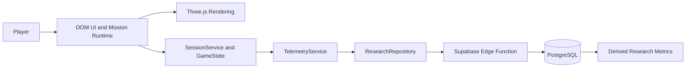

<div align="center">

# ApuLab Station

### One mission. Seven progressive levels. A hands-on STEM learning experience.

**ApuLab Station is an open-source 3D STEM learning game where players measure, compare, program, debug, optimize, and investigate their way through one complete seven-level mission.**

[](https://apulab-station-game.vercel.app/)
[](https://apulab-station-game.vercel.app/)
[](https://threejs.org/)
[](https://www.typescriptlang.org/)
[](OPEN_SOURCE.md)

**Production:** https://apulab-station-game.vercel.app/

</div>

---

## Overview

ApuLab Station is a browser-based 3D learning experience designed around **learning by doing**. Instead of presenting STEM concepts only as explanations, the game places players inside a research-station narrative where they must interact with instruments, interpret evidence, build programs, correct mistakes, recognize patterns, and complete a scientific investigation.

The experience is intentionally structured as **one continuous mission with seven progressive levels**. Each level introduces a new technical idea while reusing skills developed earlier in the mission.

The project combines:

- interactive 3D scenes and mission logic;
- electronics and measurement activities;
- block-based computational thinking challenges;
- robotics-inspired movement and planning;
- scientific investigation and instrument selection;
- privacy-conscious behavioral telemetry for controlled research sessions;
- automated build, security, research, and browser E2E validation.

## At a glance

| | |
| --- | --- |
| **Experience** | One complete STEM mission |
| **Progression** | 7 integrated levels |
| **Status** | Complete and deployed |
| **Runtime** | Three.js + TypeScript + Vite |
| **Research backend** | Supabase Edge Functions + PostgreSQL |
| **Deployment** | Vercel |
| **Quality gates** | GitHub Actions + browser E2E |
| **Source license** | MIT |
| **Original content license** | CC BY 4.0 |

## Mission progression

The mission moves from direct observation and measurement toward programming, optimization, and scientific decision-making.

| Level | Focus | What the player does |
| --- | --- | --- |
| **1 — Measure** | Electronics and measurement | Configure a multimeter, connect the probes correctly, interpret polarity, and obtain a valid voltage reading. |
| **2 — Compare** | Evidence-based comparison | Measure multiple batteries, compare results, and select the appropriate option from the collected evidence. |
| **3 — Move & Orient** | Sequential programming | Build movement sequences using forward and turn commands to guide AYNI through the grid. |
| **4 — Plan & Correct** | Debugging and iteration | Execute a program, encounter obstacles, identify what failed, and revise the sequence until it works. |
| **5 — Patterns & Repeat** | Abstraction and loops | Detect repeated structure, unlock `REPEAT`, and refactor a longer solution into a more compact program. |
| **6 — Scientific Operations** | Structured scientific workflow | Reach scientific checkpoints, scan, analyze, reach the communication point, and send the collected data. |
| **7 — Scientific Investigation** | Instrument choice and evidence | Reach the sample, analyze it, select the instrument that provides the needed evidence, interpret the result, and complete the mission. |

### Learning arc

```text
Measure → Compare → Program → Debug → Recognize Patterns → Operate Scientifically → Investigate
```

The mission is designed as a progression rather than seven independent activities: later levels build on interaction patterns, planning habits, and problem-solving strategies introduced earlier.

## What makes ApuLab Station different

### A single coherent mission

The experience is not a collection of disconnected mini-games. All seven levels belong to the same mission and share a common narrative, interface language, progression model, and technical context.

### Hands-on STEM interaction

Players interact with simulated instruments and systems instead of only selecting answers. Measurement, programming, debugging, scientific operations, and evidence interpretation are represented as actions inside the game.

### Engineering-focused progression

The mission moves beyond task completion. It asks players to test, fail, revise, simplify, and choose tools based on evidence — behaviors that are central to engineering and scientific problem solving.

### Research-ready instrumentation

ApuLab Station includes a separate study pipeline that can record anonymous behavioral events such as attempts, execution sequences, help usage, time-to-goal, program edits, failures, loop usage, scientific actions, and final instrument selection.

## System architecture



The architecture separates the interactive game from research persistence. Three.js is responsible for rendering and interactive worlds, while session and telemetry services manage research-specific state and communication with the backend.

For a deeper technical description, see [`docs/ARCHITECTURE.md`](docs/ARCHITECTURE.md).

## Technology stack

| Technology | Role |
| --- | --- |
| **Three.js 0.180.0** | 3D rendering, cameras, environments, characters, lighting, and effects |
| **TypeScript 5.9.2** | Application logic, state, telemetry, runtime contracts, and tooling |
| **Vite 7.3.6** | Development server, bundling, and production builds |
| **HTML / DOM / CSS** | Menus, HUD, dialogs, overlays, forms, and accessibility |
| **Supabase** | Study authentication, Edge Functions, telemetry ingestion, PostgreSQL storage, and analytics |
| **Vercel** | Production deployment |
| **GitHub Actions** | Build verification, security checks, research validation, and browser E2E |
| **Node.js** | Mission generation, validation, patching, and build tooling |

## Engineering highlights

ApuLab Station includes more than the visible gameplay layer. The repository also contains infrastructure for repeatable builds, telemetry integrity, and study isolation.

- **Seven-level mission build pipeline** with automated generation and validation.
- **Browser E2E coverage** for mission navigation and interaction contracts.
- **Gameplay immutability checks** used to protect the canonical mission during research changes.
- **Version-bound study sessions** using build version and Git commit SHA.
- **Event sequencing and idempotency protections** for behavioral telemetry.
- **Bounded telemetry synchronization** with recovery-oriented queue behavior.
- **Separate DEMO, QA, and STUDY data paths** for research isolation.
- **Server-side payload validation** before research events reach PostgreSQL.

## Research and telemetry

Study mode is designed to capture **behavioral interaction data**, not personal profile data.

Examples of captured research signals include:

- session and level lifecycle events;
- attempts and time-to-goal;
- measurement attempts and valid readings;
- battery comparison and selection;
- programming edits and executions;
- collisions and explicit failures;
- `REPEAT` usage and loop-flow completion;
- scientific scan, analysis, communication, and data-send actions;
- final instrument selection and changes;
- derived participant-level metrics for Levels 1–7.

The research pipeline validates the expected build, Git commit, telemetry schema, protocol version, study assignment, and environment before accepting an official study session.

## Privacy and security

The research architecture is designed to minimize sensitive data exposure.

Key controls include:

- server-side credential verification;
- no plaintext passwords in research storage;
- no raw participant credentials in gameplay telemetry;
- browser isolation from the Supabase service-role key;
- allowlisted event types and validated payloads;
- rejection of PII and credential fields in telemetry payloads;
- explicit CORS origin allowlists;
- restricted direct access to research tables;
- session and event identity checks for idempotent ingestion.

See [`docs/SECURITY.md`](docs/SECURITY.md) for the current security model.

## Quality and validation

The repository uses automated checks to protect both gameplay and research behavior.

| Validation | Purpose |
| --- | --- |
| **Build and verify Mission 01** | Rebuild and validate the seven-level mission contract |
| **Mission 01 Browser E2E** | Exercise real browser navigation and gameplay interactions |
| **Security and Build** | Check application build and security-related constraints |
| **Research clean validation** | Validate the research runtime and integration contracts |
| **GE gameplay immutability** | Detect unintended changes to the canonical gameplay baseline |

## Quick start

### Requirements

```text
Node.js ^20.19.0 || >=22.12.0
```

### Install

```bash
npm install
```

### Run locally

```bash
npm run dev
```

### Build for production

```bash
npm run build
```

### Preview the production build

```bash
npm run preview
```

The build command reconstructs and validates the canonical Mission 01 runtime before Vite generates the production bundle.

## Repository map

| Path | Purpose |
| --- | --- |
| `.github/workflows/` | CI, build, research, security, and browser validation |
| `docs/` | Architecture, security, UI, research, and implementation documentation |
| `public/` | Public runtime assets |
| `scripts/` | Mission generation, patching, auditing, and validation tooling |
| `src/app/` | Application flow |
| `src/config/` | Shared runtime configuration |
| `src/missions/` | Canonical Mission 01 sources |
| `src/research/` | Research telemetry definitions |
| `src/story/` | Narrative and introduction |
| `src/styles/` | Shared visual system |
| `src/systems/` | Session, synchronization, telemetry, and repository services |
| `src/three/` | Three.js engine, worlds, characters, and effects |
| `src/ui/` | DOM-based interface components |
| `supabase/` | Edge Function, migrations, analytics, and SQL validation |
| `tests/` | Browser E2E and research contract tests |

## Deployment

The production build is available at:

**https://apulab-station-game.vercel.app/**

Production study sessions are tied to the deployed build and Git commit so research data can be traced to the exact software version that generated it.

## Documentation

| Document | Description |
| --- | --- |
| [`docs/ARCHITECTURE.md`](docs/ARCHITECTURE.md) | Runtime and system architecture |
| [`docs/SECURITY.md`](docs/SECURITY.md) | Research security and data-governance model |
| [`docs/UI_STANDARD.md`](docs/UI_STANDARD.md) | Canonical interface system |
| [`OPEN_SOURCE.md`](OPEN_SOURCE.md) | Repository-wide open-source policy |
| [`CONTRIBUTING.md`](CONTRIBUTING.md) | Contribution rules and workflow |
| [`THIRD_PARTY_NOTICES.md`](THIRD_PARTY_NOTICES.md) | Third-party software and media notices |

## Open source

ApuLab Station is both **open source** and **open content**.

- **Software source code:** [MIT License](LICENSE)
- **Original non-code content and assets:** [CC BY 4.0](CONTENT-LICENSE.md)
- **Third-party materials:** retain their original licenses
- **Brand and identity use:** governed separately by [`BRAND_POLICY.md`](BRAND_POLICY.md)

You may study, fork, modify, redistribute, and build on the project under the applicable license and attribution requirements.

## Contributing

Contributions are welcome. Before opening a pull request, read [`CONTRIBUTING.md`](CONTRIBUTING.md).

Please do not commit participant credentials, secrets, private datasets, personal information, or real environment files.

## License

Code is distributed under the **MIT License**. Original non-code project content is distributed under **Creative Commons Attribution 4.0 International (CC BY 4.0)** unless otherwise stated.

See [`NOTICE.md`](NOTICE.md) and [`OPEN_SOURCE.md`](OPEN_SOURCE.md) for the repository-wide licensing model.

---

<div align="center">

**ApuLab Station — Explore. Measure. Build. Debug. Investigate.**

</div>
